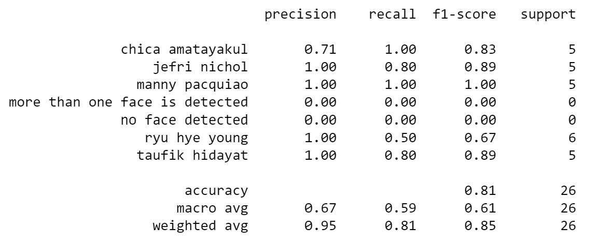

# Face Recognition Sample Endpoint API

Dokumen ini dibuat untuk menjelaskan pembuatan face recognition yang dipadukan dengan pengembangan API.

## Spesifikasi
Aplikasi ini dibuat dengan memadukan beberapa komponen atau teknologi seperti dibawah ini
* Bahasa Pemrograman
    * Python 3.9
* Framework
    * FastAPI
* Image Processing
    * Opencv2
    * Pillow
    * DeepFace
    * Tensorflow
* API Testing
    * Postman

## Instalasi
Pemasangan aplikasi dapat dilakukan dengan menyalin link pada tombol kode diatas. Lalu lakukan perintah clone dengan link git seperti ```git clone https://github.com/AlifvianM/Face-Recognition-Sample-endpoint-API.git```. 

Setelah itu lakukan perintah seperti dibawah
1. Masuk ke folder
```
cd Face-Recognition-Sample-endpoint-API
```
2. Membuat python environment
```
python -m venv <nama_env>
```
3. aktifkan environment
    * windows ```<nama_env>\Scripts\activate.bat```  atau ```<nama_env>\Scripts\Activate.ps1``` 
    * mac ```source <nama_env>/bin/activate```
4. Melakukan instalasi paket
```
pip install -r requirements.txt
```
5. Menjalankan program 
```
uvicorn main:app --reload
```

## Instalasi Dengan Docker
Repository ini juga memiliki ```Dockerfile``` dan ```docker-compose.yml``` yang bisa digunakan jika ingin dilakukan pemasangan dalam kontainer docker dengan contoh perintah seperti dibawah.
```
docker-compose up -d
```

## Pengujian
Pengujian kami lakukan dan kami catat didalam ```Testing.ipynb``` dan berikut hasilnya.


## Endpoint
Aplikasi ini memiliki 3 endpoint
- ```/``` base route atau home route dari aplikasi ini
- ```/face_registration``` route untuk meregistrasi gambar
- ```/face_recognition``` route untuk mendeteksi gambar yang diinputkan

# Penutup
Demikian repo yang telah dibuat. Jika ada kurang lebih silahkan untuk memberikan tanggapannya. Semoga repo ini dapat membantu semua yang tengah membutuhkan cara tentang pengintegrasian machine learning model dengan backend/API.